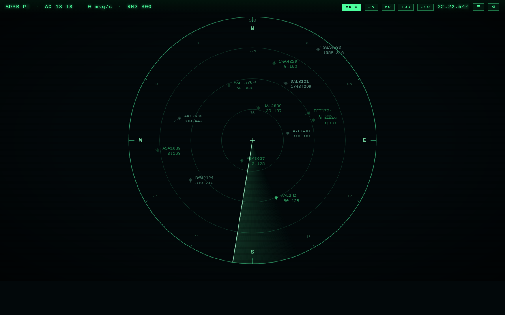

# adsb-pi

Turn a Raspberry Pi + RTL-SDR dongle into an ATC-style radar scope for the
aircraft overhead.



## Hardware

- Raspberry Pi (tested on Pi OS / Debian trixie, aarch64)
- RTL-SDR USB dongle (RTL2832U, e.g. the generic DVB-T sticks)
- 1090 MHz antenna (the stock whip works; a proper ADS-B antenna works better)

## Quick start (on the Pi)

```sh
git clone https://github.com/fuziontech/adsb-pi.git
cd adsb-pi
sudo ./install.sh
```

Then open `http://<pi-ip>:8080/` from any browser on the network. If the Pi has
a display attached, the radar comes up fullscreen in kiosk mode on next login.

The installer:

1. Installs [readsb](https://github.com/wiedehopf/readsb) + rtl-sdr tools
2. Blacklists the DVB-T kernel drivers so the SDR can be used raw
3. Starts `readsb` decoding ADS-B (1090 MHz), writing `/run/readsb/aircraft.json`
4. Starts `adsb-radar.service` -- a dependency-free Python web server on :8080
5. Adds a kiosk-mode chromium to the labwc desktop autostart

## The scope

- Classic ATC green-phosphor look: range rings, sweep, fading target afterglow
- Data blocks with callsign, flight level, climb/descent arrow, ground speed
- Heading leader lines (2 minutes of travel) and position trails
- Color encodes altitude; ground traffic is amber; emergency squawks flash red
- Click a target (or a row in the aircraft list) for range/bearing/squawk
- AUTO range mode follows the farthest contact, or pin it to 25/50/100/200 NM

## Configuration

Set the receiver location from the UI (gear icon) or in
`~/.config/adsb-pi/config.json` / `/etc/adsb-pi/config.json`:

```json
{
  "lat": 37.6213,
  "lon": -122.3790,
  "range_nm": 100,
  "site_name": "ADSB-PI"
}
```

Without a receiver location the scope centers on the centroid of current traffic.

## Demo mode (no SDR required)

```sh
python3 tools/fake_feed.py --out /tmp/aircraft.json &
python3 radar/server.py --data /tmp/aircraft.json
```

## Data flow

```
RTL-SDR --(USB)--> readsb --> /run/readsb/aircraft.json
                                   |
                           radar/server.py (:8080)
                                   |
                     /api/aircraft --> radar.js (canvas scope)
```

readsb also exposes the usual feeders' ports: SBS on 30003, Beast on 30005,
raw on 30001/30002 -- handy if you later want to feed FlightAware/ADS-B Exchange.

## Uninstall

```sh
sudo systemctl disable --now adsb-radar readsb
sudo rm -rf /opt/adsb-pi /etc/systemd/system/adsb-radar.service
sed -i '/adsb-kiosk/d' ~/.config/labwc/autostart
```
